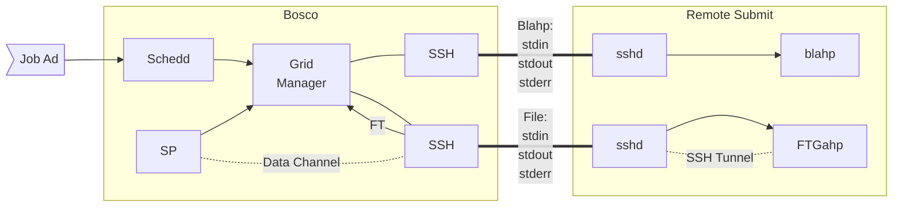

Bosco Overview
===

```mermaid
%% -- HEADER --
flowchart LR
%% -- HEADER --
%% -- BODY --
%% External nodes are numbered (0 - 100)
%% Internal nodes are alphabetic (A - Z)
	subgraph Bosco
		A[Schedd] --> B[Grid</br>Manager]
		C[SP] --> B
		B --- D[SSH]
		B --- E[SSH]
		E --> |FT|B
		C -. Data Channel .- E
	end
	subgraph Remote Submit
		F[sshd] --> G[blahp]
		H[sshd] --> I[FTGahp]
		H -. SSH Tunnel .- I
	end
%% - EXTERNAL NODES BELOW THIS POINT -
0>Job Ad] --> A
%% - End External Nodes -
%% - Link nodes and subgraphs here -
D ===|Blahp:</br>stdin</br>stdout</br>stderr| F
E ===|File:</br>stdin</br>stdout</br>stderr| H
%% - End Links
%% -- BODY --
```
