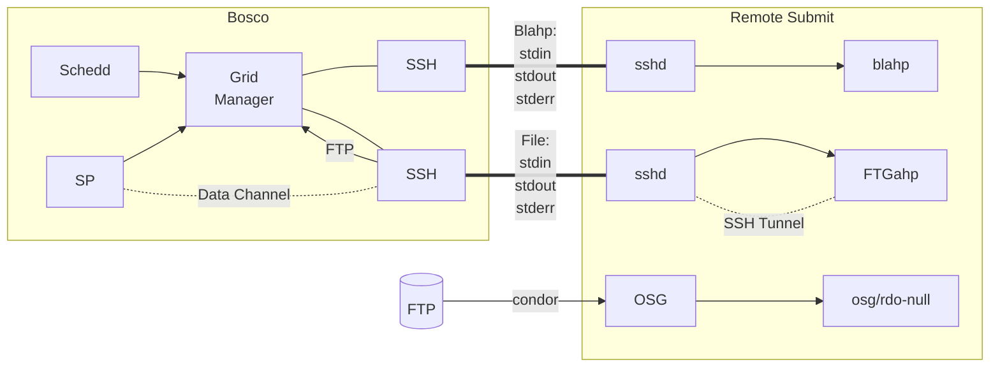

Bosco Overview
===

```mermaid
flowchart LR
	subgraph Bosco
		1[Schedd] --> 2[Grid</br>Manager]
		3[SP] --> 2
		2 --- 4[SSH]
		2 --- 5[SSH]
		5 --> |FTP|2
		3 -. Data Channel .- 5
	end
	subgraph Remote Submit
		a[sshd] --> b[blahp]
		c[sshd] --> d[FTGahp]
		d -. SSH Tunnel .- c
		e[OSG] --> f[osg/rdo-null]
	end
id1[(FTP)] --> |condor|e
4 ===|Blahp:</br>stdin</br>stdout</br>stderr| a
5 ===|File:</br>stdin</br>stdout</br>stderr| c
```
